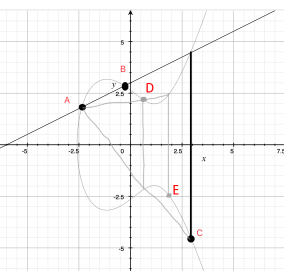

## 简介

ECC(Ellipse Curve Cryptography)又称椭圆曲线密码体制、椭圆曲线加密算法等。 椭圆曲线加密算法在比特币、区块链上有着广泛的应用。

公式：
y^2 = x^3 + ax + b

这里使用简单易懂的方式对大家介绍这部分内容，让大家有个简单的理解

## 原理简介

### 公私钥加密内容
公钥未公开部分，私钥则是不可泄露的
过程就是吧需要加密的信息用公钥进行加密，然后发送给私钥进行解密，且只有私钥可以进行解密
这里就会牵扯出两个问题：
1. 公钥加密的过程是快速的，且简单的
2. 加密后的信息是不可逆的且直接进行解密是困难的，及不可逆。

椭圆曲线示例：

1. 椭圆曲线是x轴对称的，在y轴正向随便选择一个点，-y一定会有一个对称点
2. 随便在图形上找两个点，两个点连成线，然后延长会经过第三个点（垂直线除外）

如图，A、B延长线之后，寻找y轴的对称点，会得到点C，即一个运算，A-B得到C
简单的说为点运算（此点运算就是椭圆曲线的加运算）：A点B=C

连接AC，相交于一点，找到其对称点 D，即：A点C=D

依次类推，比如点E，再一次连接AE，可以找到更多的点

### 图形讲解

## 相关阅读
