import {EmbedGiscus} from '@site/src/components/Talk'

# NFT （ERC721）

### NFT (Non-Fungible Token) 介绍

当下较为火爆的一个概念， NFT代指非同质化代币，是在一个区块链上代表独特物品的数字令牌，例如数字艺术品，特殊的游戏内商品，稀有交易卡收藏品或任何其他独特的数字/物理资产。与FT不同的是，他不可以拆分，FT比如100可以拆分为100个1，每个1的价值也都是一致的，但是NFT就是有1，并且是没法拆分的，亦可理解为`非同质化货物`，指的就是现实世界中，不存在表现出完全相似特征或价值的两种商品。

NFT标志着基于区块链的资产的最新演变，超越加密货币、稳定币、治理代币和实用代币，为用户提供一种具有创新所有权和分发模式的新型数字资产。

web3中有各种各样的协议，比如ERC20、ERC721、ERC1155，这些命名，其实很简单，就是代指的是提案的编号，EIP20、EIP721等，所以可以不在这个名称上去纠结，另外，可以看下扩展的协议内容，这里主讲的是NFT 中的ERC721（1155协议，最好是用在游戏方面，毕竟1155协议的提出者就是Enjin的游戏服务商，所以NFT不建议使用1155协议），所以加个扩展链接：[EIP 721](https://eips.ethereum.org/EIPS/eip-721)这里详细解释了协议中的函数，如果想要实现一个NFT合约，那就需要编写对应的函数。

OpenZeppelin Wizard等工具为开发人员提供了单击和编写功能，以便在短时间内创建可组合和安全的智能合约，这里我们会使用rinkeby网络节点来进行测试。

在NFT中代表他唯一性的标识就是`token id`。

**	本文会介绍几种不同的编码方式，以及使用场景。**

### 所需环境

* `remix`：直接使用在线编辑器即可 [Remix](https://remix.ethereum.org/)

* `metamask`钱包：[Metamask](https://metamask.io/)
*  `Rinkeby` 测试网水龙头：[Rinkeby](https://rinkebyfaucet.com/) 另外chainlink也提供了一个[ChainLink Rinkeby](https://faucetlink.to/select)
* `Opensea` 测试网，可以从这里查看到你部署的NFT显示的内容 [Opensea testnet](https://testnets.opensea.io/zh-CN) 此为测试网，主网为：[Opensea](https://opensea.io/)
* `Rinkeby` 区块链浏览器 [Rinkeby scan](https://rinkeby.etherscan.io/)
* `OpenZeppelin`合约开发库，这部分直接使用github上的数据来用（如果不行，后面会介绍下解决方案，通过remix插件使用本地的库来写）

**metamask 新建一个地址用于部署、操作合约，代币从水龙头领取**

### 简单示例

```js
// SPDX-License-Identifier: MIT
pragma solidity ^0.8.0;
//引入openzeppelin
import "@openzeppelin/contracts/token/ERC721/extensions/ERC721URIStorage.sol";
import "@openzeppelin/contracts/utils/Counters.sol";

contract TestNft is ERC721URIStorage {
    using Counters for Counters.Counter;
    Counters.Counter private _tokenIds;

    constructor() ERC721("TestNft", "TN") {}

    function awardItem(address _owner, string memory _tokenURI)
    public
    returns (uint256)
    {
        uint256 newItemId = _tokenIds.current();
        _mint(_owner, newItemId);
        _setTokenURI(newItemId, _tokenURI);

        _tokenIds.increment();
        return newItemId;
    }
}
```

此合约内容较为简单，只有一个函数（如有不理解的地方可以去（[语法结构](/wiki/solidity/contract/language/)）查看），`awardItem`用于创建nft，传入`_owner`与`_tokenURI`即可创建，请注意，任何帐户都可以调用 `awardItem` 来铸造项目，实际项目应用不会这么去写（为了限制哪些帐户可以制造项目，我们可以添加访问控制）。

`openzeppelin`（以下简称OZ）库中的`ERC721URIStorage.sol`继承自`ERC721.sol`(这些可以在查看：[OZ ERC721 extensions](https://github.com/OpenZeppelin/openzeppelin-contracts/tree/master/contracts/token/ERC721/extensions))主要内容是

获取元数据（`tokenURI(uint256 tokenId)`）、设置元数据（`_setTokenURI(uint256 tokenId, string memory _tokenURI)`）、销毁NFT（`_burn(uint256 tokenId)`）,这里我们只需要使用设置元数据就可以了。


#### 什么是metadata

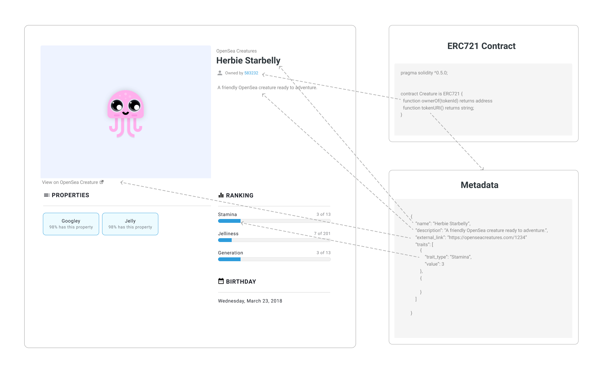

那我们来介绍下元数据 `metadata`吧，元数据`metadata`主要作为描述NFT属性的信息，如图，表述为：图片的网络地址、名称、详细描述、外连接、属性等，目前绝大多说的NFT都可以在opensea上查看，所以需要遵循一个元数据的基本规则[OpenSea metadata](https://docs.opensea.io/docs/metadata-standards)，OpenSea要为ERC721令牌引入链下元数据，合约将需要返回一个指向托管元数据的URI。为了找到这个URI, OpenSea、rare和其他流行的市场将使`ERC721URIStorage.sol`标准中包含的`tokenURI`函数，tokenId即为NFT的唯一标识。

```js
    /**
     * @dev See {IERC721Metadata-tokenURI}.
     */
    function tokenURI(uint256 tokenId) public view virtual override returns (string memory) {
        require(_exists(tokenId), "ERC721URIStorage: URI query for nonexistent token");

        string memory _tokenURI = _tokenURIs[tokenId];
        string memory base = _baseURI();

        // If there is no base URI, return the token URI.
        if (bytes(base).length == 0) {
            return _tokenURI;
        }
        // If both are set, concatenate the baseURI and tokenURI (via abi.encodePacked).
        if (bytes(_tokenURI).length > 0) {
            return string(abi.encodePacked(base, _tokenURI));
        }

        return super.tokenURI(tokenId);
    }
```

ERC721中的`tokenURI`函数应返回`HTTP`或`IPFS URL`，例如`ipfs://QmeSjSinHpPnmXmspMjwiXyN6zS4E9zccariGR3jxcaWtq/6`（此为bayc的元数据），或者是http协议的GET请求，当调用时，此URL应返回带有元数据的属性，以显示您的NFT信息。

#### Metadata格式（调用`tokenURI`函数的返回URL）

使用json格式来存储`metadata`的信息数据，如下所示：

```js
{ 
  "description": "YOUR DESCRIPTION",
  "external_url": "YOUR URL",
  "image": "IMAGE URL",
  "name": "TITLE", 
  "attributes": [
    {
      "trait_type": "Base", 
      "value": "Starfish"
    }, 
    {
      "trait_type": "Eyes", 
      "value": "Big"
    }, 
    {
      "trait_type": "Mouth", 
      "value": "Surprised"
    }, 
    {
      "trait_type": "Level", 
      "value": 5
    }, 
    {
      "trait_type": "Stamina", 
      "value": 1.4
    }, 
    {
      "trait_type": "Personality", 
      "value": "Sad"
    }, 
    {
      "display_type": "boost_number", 
      "trait_type": "Aqua Power", 
      "value": 40
    }, 
    {
      "display_type": "boost_percentage", 
      "trait_type": "Stamina Increase", 
      "value": 10
    }, 
    {
      "display_type": "number", 
      "trait_type": "Generation", 
      "value": 2
    }
  }
```


此外如果支持其他的多媒体类型，比如：音频、视频和3D模型，下面是每个属性存储的内容的简要说明

|image|这是项目图像的URL。可以是任何类型的图片，也可以是IPFS url或路径。<br />|
| :------------------------| :-------------------------------------------------------------------------------------------------------------------------------------------------------------------------------------------------------------------------------------------------------------------------------------------------------------|
|**image_data**|**原始SVG图像数据，如果您想动态生成图像(不推荐)。只有在不包括image参数的情况下才使用这个参数。**|
|**external_url**|**这个URL将出现在OpenSea上资产图像的下方，允许用户离开OpenSea并查看您站点上的项目。**|
|**description**|**NFT的描述**|
|**name**|**NFT名称**|
|**attributes**|**这些是NFT的属性**|
|**animation_url**|**项目的多媒体附件的URL。支持文件扩展名“GLTF”、“GLB”、“WEBM”、“MP4”、“M4V”、“OGV”、“OGG”，支持音频扩展名“MP3”、“WAV”、“OGA”。动画url还支持HTML页面，允许你使用JavaScript画布、WebGL等构建丰富的体验和交互式nft。现在支持HTML页面中的脚本和相对路径。但是，不支持访问浏览器扩展。**|

**属性（Attributes），可以使NFT内容更为详尽，比如NFT的背景色、人物名称、人物穿着等**

现在，我们对您的NFT元数据中的内容有简要了解，让我们学习如何创建并将其存储在IPFS上。

可以在[Pinata](https://app.pinata.cloud/)上注册申请一个账号，用于上传保存ipfs数据，此网站有1G的免费额度，操作只需要点击upload就行（也可以使用里面的Api）

上传metadata前，先上传图片（或者其他文件）

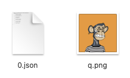

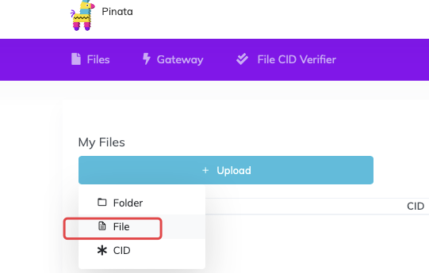

选择q.png，点击upload

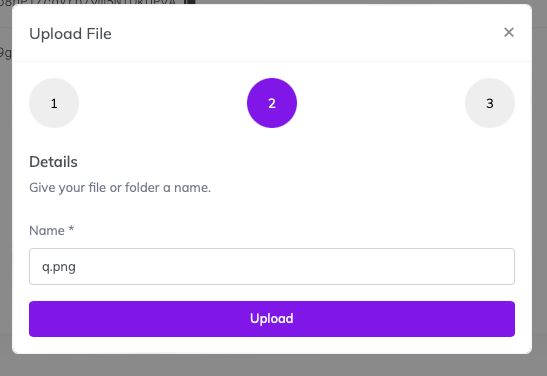


之后将metadata中的`image`标签写为ipfs://Qmxxxxx 的格式，如：`ipfs://QmRRPWG96cmgTn2qSzjwr2qvfNEuhunv6FNeMFGa9bx6mQ`

填好自己的图片属性之后：

```js
{
    "image": "ipfs://QmRRPWG96cmgTn2qSzjwr2qvfNEuhunv6FNeMFGa9bx6mQ",
    "attributes": [
        {
            "trait_type": "Earring",
            "value": "Silver Hoop"
        },
        {
            "trait_type": "Background",
            "value": "Orange"
        },
        {
            "trait_type": "Fur",
            "value": "Robot"
        },
        {
            "trait_type": "Clothes",
            "value": "Striped Tee"
        },
        {
            "trait_type": "Mouth",
            "value": "Discomfort"
        },
        {
            "trait_type": "Eyes",
            "value": "X Eyes"
        }
    ]
}
```

上传此json文件（与上传图片一致）


即：`ipfs://Qmax3fBSwgbcMdi29DM2pkpttZGuQJDsudRCM7GK3SinzX` ，

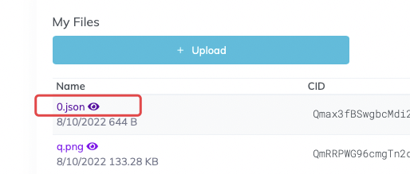

使用网关打开，或者直接使用 `https://ipfs.io/ipfs/Qmax3fBSwgbcMdi29DM2pkpttZGuQJDsudRCM7GK3SinzX` 打开（`https://ipfs.io/ipfs/<你的CID>` 为公共网关）


下面可以进行合约的部署了

打开remix，选择rinkeby网络

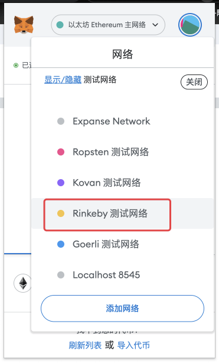

Remix点击侧边栏`DEPLOY & RUN TRANSACTIONS`

选择 `injected Provider`


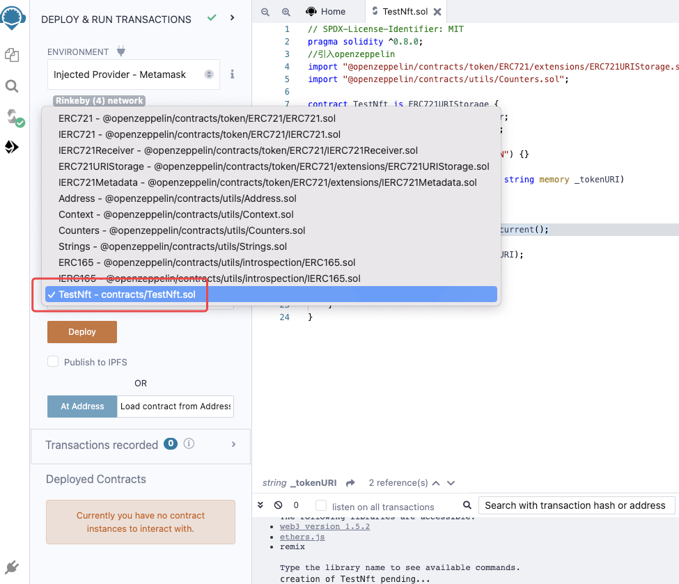

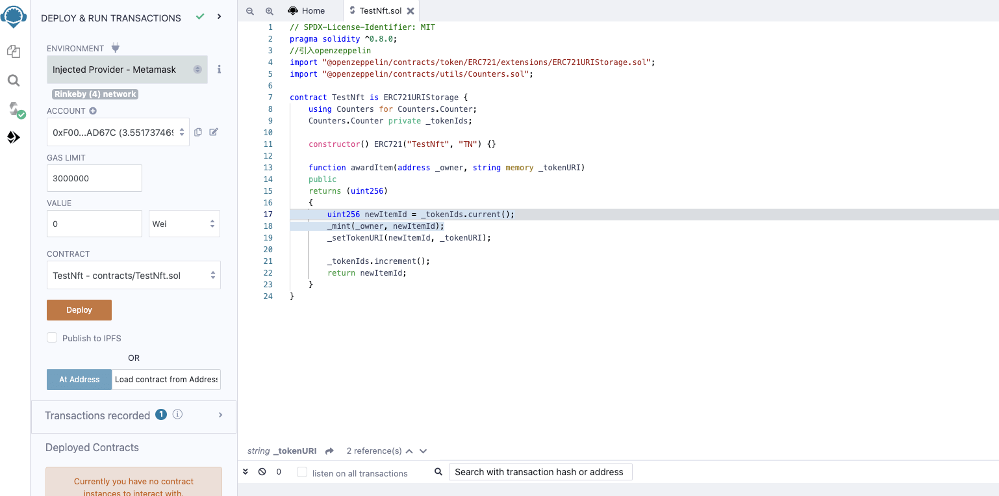

`CONTRACT`会列出需要部署的合约依赖的所有合约，所以会看到很多合约，选择需要部署的那个`TestNft`,点击`Deploy`即可部署，metamask会跳出，点击确定即可：

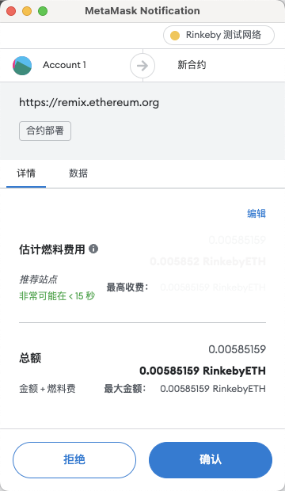

等待执行结束，日志框会打印出信息，并且`Deployed Contracts` 会显示当前部署的合约


### 铸造NFT

这里每个人的地址不一样，所以合约是不一样的，以下是函数

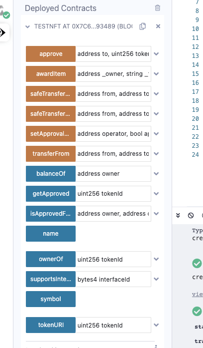

橙色函数实际上是在区块链上写的函数，而蓝色函数是从区块链读的函数。详细教程可以参考[Remix 教程](/wiki/solidity/deploy/remix/)

单击`awardItem`函数下拉图标，并将您的地址和以下字符串粘贴到`_tokenURI`字段

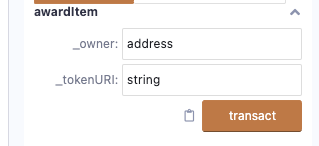

这里我们直接使用ipfs数据，使用刚才上传好的，

* `_owner` 代表你要发给哪个用户，
* `_tokenURI`代表你的metadata数据的URI

刚才我们吧metadata的URI（json属性数据的URI）上传到了`ipfs://Qmax3fBSwgbcMdi29DM2pkpttZGuQJDsudRCM7GK3SinzX`这个上，所以`_tokenURI`直接填写`ipfs://Qmax3fBSwgbcMdi29DM2pkpttZGuQJDsudRCM7GK3SinzX`即可（注意此处可以使用ipfs协议，如描述所示的格式，也可以正常使用http协议，能够使用GET函数获取URI返回的json数据就行）

我们想要发给自己则填写的信息如下：

`_owner`:`0xF00079382099f609DbC37F5A7EA04F14D4eAD67C`

`_tokenURI`:`ipfs://Qmax3fBSwgbcMdi29DM2pkpttZGuQJDsudRCM7GK3SinzX`

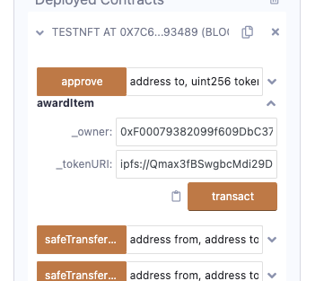

点击`transact`，调出metamask

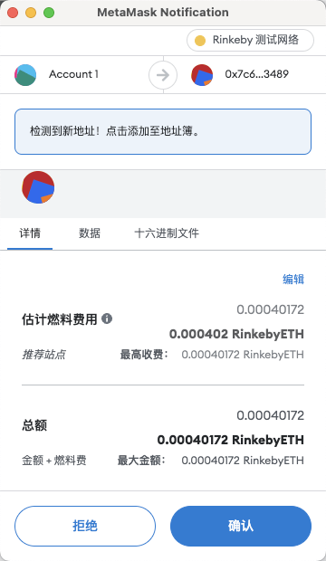

点击确认

然后复制我们的合约地址：`0x7c697718670aa5993Df2E8A813BBFA1F51593489`


到opensea的rinkeby测试网查看合约信息：


可以看到我们刚才发放的NFT

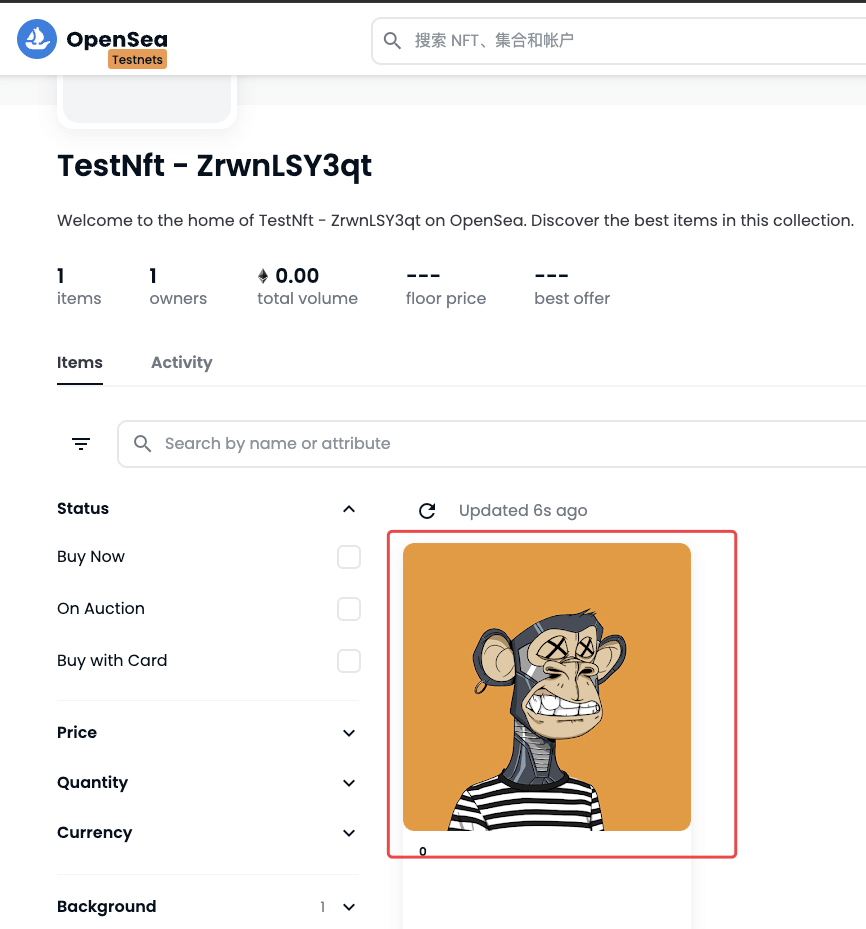

点击详情，可以查看刚才写在metadata中的属性信息

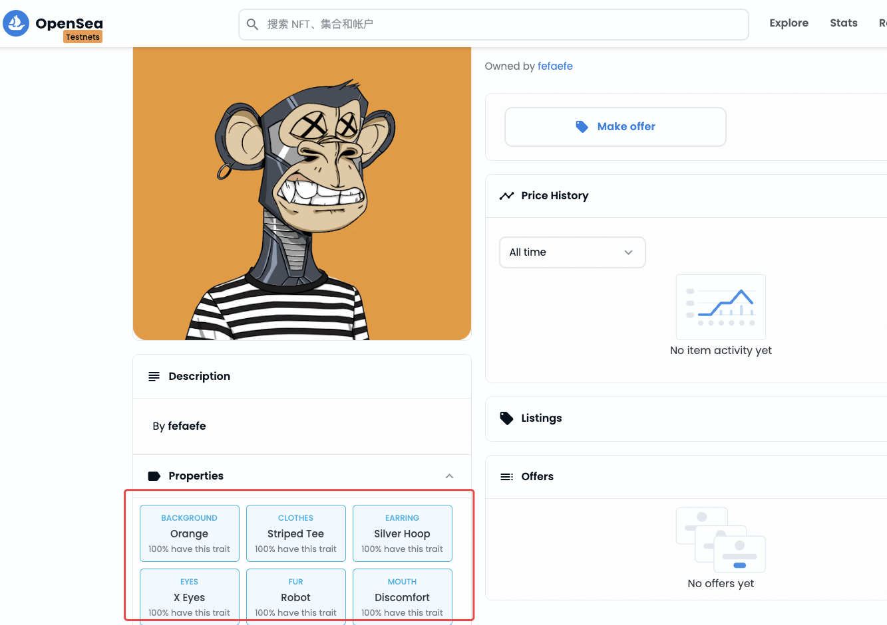


然后我们打开rinkeby区块链浏览器，同样复制NFT合约查看信息：

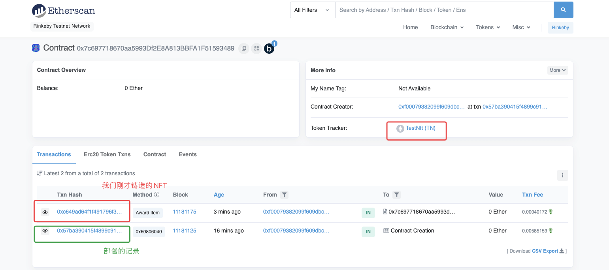

至此，一个简单的NFT发放合约就完成了。(๑′ᴗ‵๑)


### 较常用的继承

可铸造的ERC-721 OpenZeppelin令牌合约提供了一个`mint`函数，同样支持枚举（可以查询用户拥有哪些NFT），该函数只能由合约的所有者调用。默认情况下，所有者是合同的部署者地址。

```js
// SPDX-License-Identifier: UNLICENSED
pragma solidity ^0.8.0;

import "@openzeppelin/contracts/token/ERC721/ERC721.sol";
import "@openzeppelin/contracts/token/ERC721/extensions/ERC721Enumerable.sol";
import "@openzeppelin/contracts/access/Ownable.sol";

contract MyToken is ERC721, ERC721Enumerable, Ownable {
    constructor() ERC721("MyToken", "MTK") {}

    function safeMint(address to, uint256 tokenId) public onlyOwner {
        _safeMint(to, tokenId);
    }

    //重写父类的_baseURI,当调用_tokenURI()的函数时，直接调用此函数
    function _baseURI() internal pure override returns (string memory) {
        return "ipfs://QmeSjSinHpPnmXmspMjwiXyN6zS4E9zccariGR3jxcaWtq/";
    }

    //固定格式，此为在转移之前执行的业务逻辑，没有则可以不用改写
    function _beforeTokenTransfer(address from, address to, uint256 tokenId)
        internal
        override(ERC721, ERC721Enumerable)
    {
        super._beforeTokenTransfer(from, to, tokenId);
    }

    //遵循的协议，可以不用管它
    function supportsInterface(bytes4 interfaceId)
        public
        view
        override(ERC721, ERC721Enumerable)
        returns (bool)
    {
        return super.supportsInterface(interfaceId);
    }
}
```

对于本例，使用的代码结合了来自OpenZeppelin的不同合约

* `ERC721.SOL` - ERC-721 NFT 实现，具有基本接口的可选功能。包括具有_mint功能的供应机制，但需要从主合同中明确调用
* `ERC721enumerable.sol` - 扩展以允许代币的链枚举，查询用户拥有哪些NFT
* `Ownable.sol` - 限制访问某些功能的扩展，当前是只有部署者可以操作对应修饰的函数

父类`ERC721`中的函数：

```js

    /**
     * @dev Base URI for computing {tokenURI}. If set, the resulting URI for each
     * token will be the concatenation of the `baseURI` and the `tokenId`. Empty
     * by default, can be overriden in child contracts.
     */
    function _baseURI() internal view virtual returns (string memory) {
        return "";
    }
  
    /**
     * @dev See {IERC721Metadata-tokenURI}.
     */
    function tokenURI(uint256 tokenId) public view virtual override returns (string memory) {
        require(_exists(tokenId), "ERC721Metadata: URI query for nonexistent token");

        string memory baseURI = _baseURI();
        return bytes(baseURI).length > 0 ? string(abi.encodePacked(baseURI, tokenId.toString())) : "";
    }

```

如上述所示：

其中父类的`_baseURI()`函数已被子类重写，所以`_baseURI()`的返回值为：`ipfs://QmeSjSinHpPnmXmspMjwiXyN6zS4E9zccariGR3jxcaWtq/`

`tokenURI(uint256 tokenId)`函数组装的数据为：如果`_baseURI()`有返回值，则拼接为`_baseURI()`+`tokenId.toString`即如果`_baseURI()`为`ipfs://QmeSjSinHpPnmXmspMjwiXyN6zS4E9zccariGR3jxcaWtq/`则tokenId为0的`tokenURI`为`ipfs://QmeSjSinHpPnmXmspMjwiXyN6zS4E9zccariGR3jxcaWtq/0`

剩下的大家自己测试结果即可。

---

### 扩展

以下作为扩展合约的说明，就不用按照部署步骤来进行了，如果想使用hardhat与truffle可以看相关的教程TODO

主要分为几种模式：

* 发售NFT（ERC721）常用的函数
* ERC721的变体
* Metadata的变体

我们来设置下基础的URI，以及设置铸币价格、最大供应量和从铸币中提取收集到的收益的可能性来扩展我们的NFT。

这里我们给出一个简单的应用场景：

* 总量为10000个，编号为0~9999
* 白名单消耗0.0008 eth铸造
* 公共铸造消耗0.001 ETH
* eth打入合约中，管理员可以提取eth

### 发售NFT（ERC721）常用的函数

你可以用下面的代码片段替换你当前的NFT合约，命名为`TestNft2`

```js
// SPDX-License-Identifier: UNLICENSED
pragma solidity >=0.8.10;

import "@openzeppelin/contracts/token/ERC721/extensions/ERC721Enumerable.sol";
import "@openzeppelin/contracts/utils/Strings.sol";
import "@openzeppelin/contracts/access/Ownable.sol";
import "@openzeppelin/contracts/utils/Counters.sol";

contract TestNft2 is ERC721Enumerable, Ownable {
    using Strings for uint256;
    using Counters for Counters.Counter;

    string public baseURI;
    //nft token id计数器
    Counters.Counter private _tokenIds;
    uint256 public constant TOTAL_SUPPLY = 10_000;
    uint256 public constant MINT_PRICE = 0.0008 ether;
    uint256 public constant PUBLIC_MINT_PRICE = 0.001 ether;
    mapping(address => bool) public whitelist;

    constructor() ERC721("TEST NFT 2", "TN2") {
        baseURI = "ipfs://QmeSjSinHpPnmXmspMjwiXyN6zS4E9zccariGR3jxcaWtq/";
    }

    /**
     * @dev 管理员添加白名单
     */
    function addWhitelist(address[] memory _winners) external onlyOwner{
        for(uint8 i; i < _winners.length; i++){
            whitelist[_winners[i]] = true;
        }
    }

    /**
     * @dev 白名单铸造
     */
    function whitelistMint(address recipient) public payable returns (uint256) {
        require(msg.value == MINT_PRICE, "TestNft2: Whitelist price error");
        uint256 newTokenId = _tokenIds.current();
        require(newTokenId < TOTAL_SUPPLY, "TestNft2: Over total supply");
        _safeMint(recipient, newTokenId);
        _tokenIds.increment();
        return newTokenId;
    }

    /**
     * @dev 公共铸造
     */
    function publicMint(address recipient) public payable returns (uint256) {
        require(msg.value == PUBLIC_MINT_PRICE, "TestNft2: Public price error");
        uint256 newTokenId = _tokenIds.current();
        require(newTokenId < TOTAL_SUPPLY, "TestNft2: Over total supply");
        _safeMint(recipient, newTokenId);
        _tokenIds.increment();
        return newTokenId;
    }

    /**
     * @dev 重写 tokenURI，返回需要的metadata数据
     */
    function tokenURI(uint256 tokenId)
        public
        view
        virtual
        override
        returns (string memory)
    {
        require(ownerOf(tokenId) == address(0),"TestNft2: Token id not exist");
        return
            bytes(baseURI).length > 0
                ? string(abi.encodePacked(baseURI, tokenId.toString()))
                : "";
    }
  
    /**
     * @dev 管理员提取eth资金
     */
    function withdrawPayments(address payable payee) external onlyOwner {
        uint256 balance = address(this).balance;
        (bool transferTx, ) = payee.call{value: balance}("");
        require(!transferTx,"TestNft2: withdraw error");
    }
}
```

当然此方法也可以加入其他的内容，比如给白名单和公共铸造添加一个时间顺序，白名单1月1日铸造，公共开放1月2日，或者使用其他的方式添加白名单，比如给到用户特殊的签名用于验证，这样就可以不用使用消耗手续费的方式。

### ERC721的变体

目前较为著名的就是Azuki的ERC721A，此合约库主要利用tokenId的连续性来批量铸造减少手续费（原合约主要消耗在`ownerOf`与`tokenOfOwnerByIndex`函数的数据存储上），当然是重新的枚举`ERC721Enumerable.sol`合约的方式。

原理是：当用户调用批量铸造的时候（区块链本身就有防止并发出现的逻辑（防双花），所以不会有同时有人获取同一个tokenId的情况），记录当前用户的第一个tokenId，然后根据数量计算最后一个tokenId，这样就产生了一个区间，如当前的tokenId为4，用户铸造5个，则 4、5、6、7、8 tokenId都为此用户的，**并记录最小的 4 tokenId用来其他的方法的数据计算**。

然后是有4个重要方法

* 1. 铸造函数`_safeMint`
* 2. 读取NFT（tokenId）的拥有者函数`ownerOf`
* 3. 转移NFT函数`_transfer`
* 4. 用户拥有的NFT函数`tokenOfOwnerByIndex`与用户拥有的NFT总量`balanceOf`

【1】已经说过了，记录用户拥有的tokenId区间，另外也会记录，当前用户拥有的总量，及对应【4】拥有的NFT函数

【2】先判断是否存在此tokenId，判断也很简单，与最新铸造的的NFT tokenId比较，小于等于最新的，则为存在；区块中已经存储了用户记录的最小tokenId，所以只需要向 0 遍历循环tokenId即可，如查询的是7 tokenId，需要进行 7--的操作，知道取得tokenId的所属不为`address(0)`（默认值），这就找到了记录最小tokenId的用户地址。如图：


这与刚才铸造时的数据一致，所以就可以返回用户的地址了。

【3】与【2】有相似之处，当转移的时候，先检查是否为拥有者，然后需要重新写下区间的最小值，如A地址转移6到B地址，则需要将7重新作为另一个区间的最小值，最小值的所属这是A地址。

【4】与【2】也是一样的道理，只是需要遍历出所有的NFT的下标（存储值依然很小）。

代码（有些小长，但是核心的就是刚才讲的那些方法）：

```js
// SPDX-License-Identifier: MIT

pragma solidity ^0.8.0;

import "@openzeppelin/contracts/token/ERC721/IERC721.sol";
import "@openzeppelin/contracts/token/ERC721/IERC721Receiver.sol";
import "@openzeppelin/contracts/token/ERC721/extensions/IERC721Metadata.sol";
import "@openzeppelin/contracts/token/ERC721/extensions/IERC721Enumerable.sol";
import "@openzeppelin/contracts/utils/Address.sol";
import "@openzeppelin/contracts/utils/Context.sol";
import "@openzeppelin/contracts/utils/Strings.sol";
import "@openzeppelin/contracts/utils/introspection/ERC165.sol";

/**
 * @dev Implementation of https://eips.ethereum.org/EIPS/eip-721[ERC721] Non-Fungible Token Standard, including
 * the Metadata and Enumerable extension. Built to optimize for lower gas during batch mints.
 *
 * Assumes serials are sequentially minted starting at 0 (e.g. 0, 1, 2, 3..).
 *
 * Assumes the number of issuable tokens (collection size) is capped and fits in a uint128.
 *
 * Does not support burning tokens to address(0).
 */
contract ERC721A is
  Context,
  ERC165,
  IERC721,
  IERC721Metadata,
  IERC721Enumerable
{
  using Address for address;
  using Strings for uint256;

  struct TokenOwnership {
    address addr;
    uint64 startTimestamp;
  }

  struct AddressData {
    uint128 balance;
    uint128 numberMinted;
  }

  uint256 private currentIndex = 0;

  uint256 internal immutable collectionSize;
  uint256 internal immutable maxBatchSize;

  // Token name
  string private _name;

  // Token symbol
  string private _symbol;

  // Mapping from token ID to ownership details
  // An empty struct value does not necessarily mean the token is unowned. See ownershipOf implementation for details.
  mapping(uint256 => TokenOwnership) private _ownerships;

  // Mapping owner address to address data
  mapping(address => AddressData) private _addressData;

  // Mapping from token ID to approved address
  mapping(uint256 => address) private _tokenApprovals;

  // Mapping from owner to operator approvals
  mapping(address => mapping(address => bool)) private _operatorApprovals;

  /**
   * @dev
   * `maxBatchSize` refers to how much a minter can mint at a time.
   * `collectionSize_` refers to how many tokens are in the collection.
   */
  constructor(
    string memory name_,
    string memory symbol_,
    uint256 maxBatchSize_,
    uint256 collectionSize_
  ) {
    require(
      collectionSize_ > 0,
      "ERC721A: collection must have a nonzero supply"
    );
    require(maxBatchSize_ > 0, "ERC721A: max batch size must be nonzero");
    _name = name_;
    _symbol = symbol_;
    maxBatchSize = maxBatchSize_;
    collectionSize = collectionSize_;
  }

  /**
   * @dev See {IERC721Enumerable-totalSupply}.
   */
  function totalSupply() public view override returns (uint256) {
    return currentIndex;
  }

  /**
   * @dev See {IERC721Enumerable-tokenByIndex}.
   */
  function tokenByIndex(uint256 index) public view override returns (uint256) {
    require(index < totalSupply(), "ERC721A: global index out of bounds");
    return index;
  }

  /**
   * @dev See {IERC721Enumerable-tokenOfOwnerByIndex}.
   * This read function is O(collectionSize). If calling from a separate contract, be sure to test gas first.
   * It may also degrade with extremely large collection sizes (e.g >> 10000), test for your use case.
   */
  function tokenOfOwnerByIndex(address owner, uint256 index)
    public
    view
    override
    returns (uint256)
  {
    require(index < balanceOf(owner), "ERC721A: owner index out of bounds");
    uint256 numMintedSoFar = totalSupply();
    uint256 tokenIdsIdx = 0;
    address currOwnershipAddr = address(0);
    for (uint256 i = 0; i < numMintedSoFar; i++) {
      TokenOwnership memory ownership = _ownerships[i];
      if (ownership.addr != address(0)) {
        currOwnershipAddr = ownership.addr;
      }
      if (currOwnershipAddr == owner) {
        if (tokenIdsIdx == index) {
          return i;
        }
        tokenIdsIdx++;
      }
    }
    revert("ERC721A: unable to get token of owner by index");
  }

  /**
   * @dev See {IERC165-supportsInterface}.
   */
  function supportsInterface(bytes4 interfaceId)
    public
    view
    virtual
    override(ERC165, IERC165)
    returns (bool)
  {
    return
      interfaceId == type(IERC721).interfaceId ||
      interfaceId == type(IERC721Metadata).interfaceId ||
      interfaceId == type(IERC721Enumerable).interfaceId ||
      super.supportsInterface(interfaceId);
  }

  /**
   * @dev See {IERC721-balanceOf}.
   */
  function balanceOf(address owner) public view override returns (uint256) {
    require(owner != address(0), "ERC721A: balance query for the zero address");
    return uint256(_addressData[owner].balance);
  }

  function _numberMinted(address owner) internal view returns (uint256) {
    require(
      owner != address(0),
      "ERC721A: number minted query for the zero address"
    );
    return uint256(_addressData[owner].numberMinted);
  }

  function ownershipOf(uint256 tokenId)
    internal
    view
    returns (TokenOwnership memory)
  {
    require(_exists(tokenId), "ERC721A: owner query for nonexistent token");
    //tokenid 所述的最小id，因为每次mint都是记录的最小的
    uint256 lowestTokenToCheck;
    if (tokenId >= maxBatchSize) {
      lowestTokenToCheck = tokenId - maxBatchSize + 1;
    }

    for (uint256 curr = tokenId; curr >= lowestTokenToCheck; curr--) {
      TokenOwnership memory ownership = _ownerships[curr];
      if (ownership.addr != address(0)) {
        return ownership;
      }
    }

    revert("ERC721A: unable to determine the owner of token");
  }

  /**
   * @dev See {IERC721-ownerOf}.
   */
  function ownerOf(uint256 tokenId) public view override returns (address) {
    return ownershipOf(tokenId).addr;
  }

  /**
   * @dev See {IERC721Metadata-name}.
   */
  function name() public view virtual override returns (string memory) {
    return _name;
  }

  /**
   * @dev See {IERC721Metadata-symbol}.
   */
  function symbol() public view virtual override returns (string memory) {
    return _symbol;
  }

  /**
   * @dev See {IERC721Metadata-tokenURI}.
   */
  function tokenURI(uint256 tokenId)
    public
    view
    virtual
    override
    returns (string memory)
  {
    require(
      _exists(tokenId),
      "ERC721Metadata: URI query for nonexistent token"
    );

    string memory baseURI = _baseURI();
    return
      bytes(baseURI).length > 0
        ? string(abi.encodePacked(baseURI, tokenId.toString()))
        : "";
  }

  /**
   * @dev Base URI for computing {tokenURI}. If set, the resulting URI for each
   * token will be the concatenation of the `baseURI` and the `tokenId`. Empty
   * by default, can be overriden in child contracts.
   */
  function _baseURI() internal view virtual returns (string memory) {
    return "";
  }

  /**
   * @dev See {IERC721-approve}.
   */
  function approve(address to, uint256 tokenId) public override {
    address owner = ERC721A.ownerOf(tokenId);
    require(to != owner, "ERC721A: approval to current owner");

    require(
      _msgSender() == owner || isApprovedForAll(owner, _msgSender()),
      "ERC721A: approve caller is not owner nor approved for all"
    );

    _approve(to, tokenId, owner);
  }

  /**
   * @dev See {IERC721-getApproved}.
   */
  function getApproved(uint256 tokenId) public view override returns (address) {
    require(_exists(tokenId), "ERC721A: approved query for nonexistent token");

    return _tokenApprovals[tokenId];
  }

  /**
   * @dev See {IERC721-setApprovalForAll}.
   */
  function setApprovalForAll(address operator, bool approved) public override {
    require(operator != _msgSender(), "ERC721A: approve to caller");

    _operatorApprovals[_msgSender()][operator] = approved;
    emit ApprovalForAll(_msgSender(), operator, approved);
  }

  /**
   * @dev See {IERC721-isApprovedForAll}.
   */
  function isApprovedForAll(address owner, address operator)
    public
    view
    virtual
    override
    returns (bool)
  {
    return _operatorApprovals[owner][operator];
  }

  /**
   * @dev See {IERC721-transferFrom}.
   */
  function transferFrom(
    address from,
    address to,
    uint256 tokenId
  ) public override {
    _transfer(from, to, tokenId);
  }

  /**
   * @dev See {IERC721-safeTransferFrom}.
   */
  function safeTransferFrom(
    address from,
    address to,
    uint256 tokenId
  ) public override {
    safeTransferFrom(from, to, tokenId, "");
  }

  /**
   * @dev See {IERC721-safeTransferFrom}.
   */
  function safeTransferFrom(
    address from,
    address to,
    uint256 tokenId,
    bytes memory _data
  ) public override {
    _transfer(from, to, tokenId);
    require(
      _checkOnERC721Received(from, to, tokenId, _data),
      "ERC721A: transfer to non ERC721Receiver implementer"
    );
  }

  /**
   * @dev Returns whether `tokenId` exists.
   *
   * Tokens can be managed by their owner or approved accounts via {approve} or {setApprovalForAll}.
   *
   * Tokens start existing when they are minted (`_mint`),
   */
  function _exists(uint256 tokenId) internal view returns (bool) {
    return tokenId < currentIndex;
  }

  function _safeMint(address to, uint256 quantity) internal {
    _safeMint(to, quantity, "");
  }

  /**
   * @dev Mints `quantity` tokens and transfers them to `to`.
   *
   * Requirements:
   *
   * - there must be `quantity` tokens remaining unminted in the total collection.
   * - `to` cannot be the zero address.
   * - `quantity` cannot be larger than the max batch size.
   *
   * Emits a {Transfer} event.
   */
  function _safeMint(
    address to,
    uint256 quantity,
    bytes memory _data
  ) internal {
    //获取当前 tokenId
    uint256 startTokenId = currentIndex;
    require(to != address(0), "ERC721A: mint to the zero address");
    // We know if the first token in the batch doesn't exist, the other ones don't as well, because of serial ordering.
    //批量铸造有可能造成tokenId重复，然后直接从后面的开始，所以先判断下
    require(!_exists(startTokenId), "ERC721A: token already minted");
    //不能超过最大的一次铸造数量
    require(quantity <= maxBatchSize, "ERC721A: quantity to mint too high");

    _beforeTokenTransfers(address(0), to, startTokenId, quantity);
    //用户的信息
    AddressData memory addressData = _addressData[to];
    _addressData[to] = AddressData(
      //当前有多少个
      addressData.balance + uint128(quantity),
      //已经mint 多少个
      addressData.numberMinted + uint128(quantity)
    );
    //用户 开始的tokenId的时间 ，用于查询tokenid的所有者
    _ownerships[startTokenId] = TokenOwnership(to, uint64(block.timestamp));
    //最后一个tokenid
    uint256 updatedIndex = startTokenId;

    for (uint256 i = 0; i < quantity; i++) {
      //创建nft
      emit Transfer(address(0), to, updatedIndex);
      //721接收
      require(
        _checkOnERC721Received(address(0), to, updatedIndex, _data),
        "ERC721A: transfer to non ERC721Receiver implementer"
      );
      updatedIndex++;
    }
    //当前的更新为最新的
    currentIndex = updatedIndex;
    _afterTokenTransfers(address(0), to, startTokenId, quantity);
  }

  /**
   * @dev Transfers `tokenId` from `from` to `to`.
   *
   * Requirements:
   *
   * - `to` cannot be the zero address.
   * - `tokenId` token must be owned by `from`.
   *
   * Emits a {Transfer} event.
   */
  function _transfer(
    address from,
    address to,
    uint256 tokenId
  ) private {
    TokenOwnership memory prevOwnership = ownershipOf(tokenId);

    bool isApprovedOrOwner = (_msgSender() == prevOwnership.addr ||
      getApproved(tokenId) == _msgSender() ||
      isApprovedForAll(prevOwnership.addr, _msgSender()));

    require(
      isApprovedOrOwner,
      "ERC721A: transfer caller is not owner nor approved"
    );

    require(
      prevOwnership.addr == from,
      "ERC721A: transfer from incorrect owner"
    );
    require(to != address(0), "ERC721A: transfer to the zero address");

    _beforeTokenTransfers(from, to, tokenId, 1);

    // Clear approvals from the previous owner
    _approve(address(0), tokenId, prevOwnership.addr);

    _addressData[from].balance -= 1;
    _addressData[to].balance += 1;
    _ownerships[tokenId] = TokenOwnership(to, uint64(block.timestamp));

    // If the ownership slot of tokenId+1 is not explicitly set, that means the transfer initiator owns it.
    // Set the slot of tokenId+1 explicitly in storage to maintain correctness for ownerOf(tokenId+1) calls.
    //重新设置个最新值
    uint256 nextTokenId = tokenId + 1;
    if (_ownerships[nextTokenId].addr == address(0)) {
      if (_exists(nextTokenId)) {
        _ownerships[nextTokenId] = TokenOwnership(
          prevOwnership.addr,
          prevOwnership.startTimestamp
        );
      }
    }

    emit Transfer(from, to, tokenId);
    _afterTokenTransfers(from, to, tokenId, 1);
  }

  /**
   * @dev Approve `to` to operate on `tokenId`
   *
   * Emits a {Approval} event.
   */
  function _approve(
    address to,
    uint256 tokenId,
    address owner
  ) private {
    _tokenApprovals[tokenId] = to;
    emit Approval(owner, to, tokenId);
  }

  uint256 public nextOwnerToExplicitlySet = 0;

  /**
   * @dev Internal function to invoke {IERC721Receiver-onERC721Received} on a target address.
   * The call is not executed if the target address is not a contract.
   *
   * @param from address representing the previous owner of the given token ID
   * @param to target address that will receive the tokens
   * @param tokenId uint256 ID of the token to be transferred
   * @param _data bytes optional data to send along with the call
   * @return bool whether the call correctly returned the expected magic value
   */
  function _checkOnERC721Received(
    address from,
    address to,
    uint256 tokenId,
    bytes memory _data
  ) private returns (bool) {
    if (to.isContract()) {
      try
        IERC721Receiver(to).onERC721Received(_msgSender(), from, tokenId, _data)
      returns (bytes4 retval) {
        return retval == IERC721Receiver(to).onERC721Received.selector;
      } catch (bytes memory reason) {
        if (reason.length == 0) {
          revert("ERC721A: transfer to non ERC721Receiver implementer");
        } else {
          assembly {
            revert(add(32, reason), mload(reason))
          }
        }
      }
    } else {
      return true;
    }
  }

  /**
   * @dev Hook that is called before a set of serially-ordered token ids are about to be transferred. This includes minting.
   *
   * startTokenId - the first token id to be transferred
   * quantity - the amount to be transferred
   *
   * Calling conditions:
   *
   * - When `from` and `to` are both non-zero, ``from``'s `tokenId` will be
   * transferred to `to`.
   * - When `from` is zero, `tokenId` will be minted for `to`.
   */
  function _beforeTokenTransfers(
    address from,
    address to,
    uint256 startTokenId,
    uint256 quantity
  ) internal virtual {}

  /**
   * @dev Hook that is called after a set of serially-ordered token ids have been transferred. This includes
   * minting.
   *
   * startTokenId - the first token id to be transferred
   * quantity - the amount to be transferred
   *
   * Calling conditions:
   *
   * - when `from` and `to` are both non-zero.
   * - `from` and `to` are never both zero.
   */
  function _afterTokenTransfers(
    address from,
    address to,
    uint256 startTokenId,
    uint256 quantity
  ) internal virtual {}
}
```


### Metadata的变体

#### 变体1，以Loot为代表的的NFT

在日益发展的区块链，原本的metadata数据的存储方式（ipfs/中心化）不能满足所有的需求，所以衍生出一些特比的NFT，比如[Loot](https://opensea.io/zh-CN/collection/lootproject)这是一张纯区块链存储的信息，使用base64保存 svg的方式来存储数据，当然loot显示的是文字，也可以做成图片（[LOOT源码](https://etherscan.io/address/0xff9c1b15b16263c61d017ee9f65c50e4ae0113d7#code)）。

核心代码：使用字符，将一个完整svg拼接出来，metadat中，image 使用`data:image/svg+xml;base64`，来添加base64之后的svg，告诉opensea此image使用base64保存，需要解析成svg的格式。

metadata在base64之后，使用`data:application/json;base64`标注，此种方式opensea会以base64的方式解析出json的格式，之后解析出真实的metadata

```js
function tokenURI(uint256 tokenId) override public view returns (string memory) {
        string[17] memory parts;
        parts[0] = '<svg xmlns="http://www.w3.org/2000/svg" preserveAspectRatio="xMinYMin meet" viewBox="0 0 350 350"><style>.base { fill: white; font-family: serif; font-size: 14px; }</style><rect width="100%" height="100%" fill="black" /><text x="10" y="20" class="base">';
        parts[1] = getWeapon(tokenId);
        parts[2] = '</text><text x="10" y="40" class="base">';
        parts[3] = getChest(tokenId);
        parts[4] = '</text><text x="10" y="60" class="base">';
        parts[5] = getHead(tokenId);
        parts[6] = '</text><text x="10" y="80" class="base">';
        parts[7] = getWaist(tokenId);
        parts[8] = '</text><text x="10" y="100" class="base">';
        parts[9] = getFoot(tokenId);
        parts[10] = '</text><text x="10" y="120" class="base">';
        parts[11] = getHand(tokenId);
        parts[12] = '</text><text x="10" y="140" class="base">';
        parts[13] = getNeck(tokenId);
        parts[14] = '</text><text x="10" y="160" class="base">';
        parts[15] = getRing(tokenId);
        parts[16] = '</text></svg>';
        string memory output = string(abi.encodePacked(parts[0], parts[1], parts[2], parts[3], parts[4], parts[5], parts[6], parts[7], parts[8]));
        output = string(abi.encodePacked(output, parts[9], parts[10], parts[11], parts[12], parts[13], parts[14], parts[15], parts[16]));
        string memory json = Base64.encode(bytes(string(abi.encodePacked('{"name": "Bag #', toString(tokenId), '", "description": "Loot is randomized adventurer gear generated and stored on chain. Stats, images, and other functionality are intentionally omitted for others to interpret. Feel free to use Loot in any way you want.", "image": "data:image/svg+xml;base64,', Base64.encode(bytes(output)), '"}'))));
        output = string(abi.encodePacked('data:application/json;base64,', json));
        return output;
    }
```

如图所示，tokenId为1的nft：

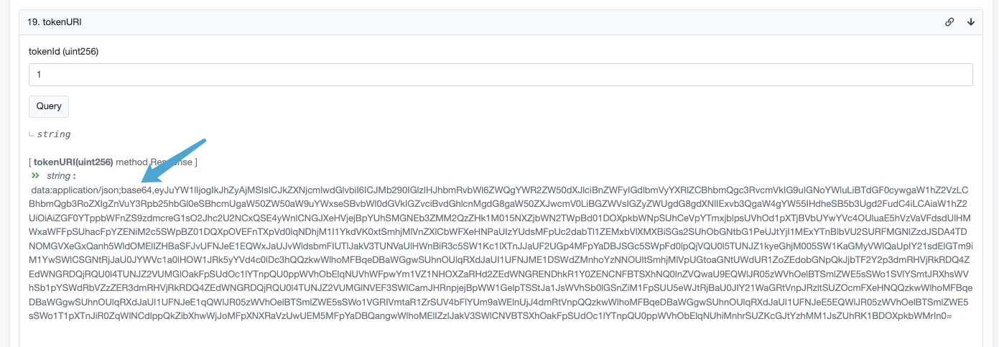

base64解析后（[随便找的解析网站](https://www.base64decode.org/)）：

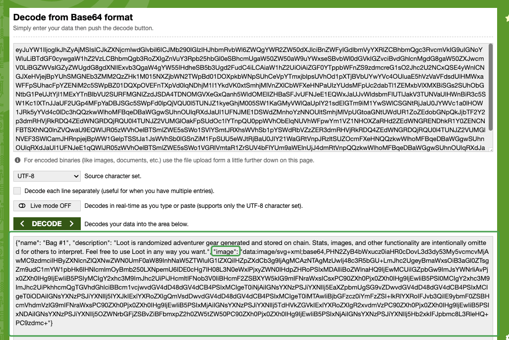

如图，image中也是base64，也需要解析


之后新建个svg文件，直接查看svg的图就行了


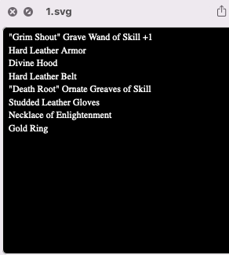

目前有很多类似的项目，大多为像素、文字、字符型的，占用的存储空间少，可以使用此方式

#### 变体2，以模型、视频或游戏为代表的的NFT

如RiverMan、sandbox项目 [River man源码](https://etherscan.io/address/0x97c628d36981270929ec81c7afc8837e06a54cb2#code)

[查询方法](https://etherscan.io/address/0xcfff4c8c0df0e2431977eba7df3d3de857f4b76e#readProxyContract)

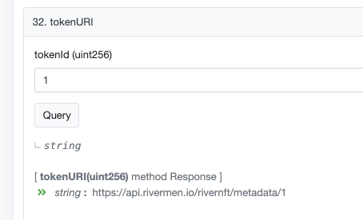

访问 https://api.rivermen.io/rivernft/metadata/1 返回结果：

```js
{
    "animation_url": "https://d32ju6eqdh546d.cloudfront.net/output/pawn/148/Pawn_7284_v3.glb",
    "image": "https://d32ju6eqdh546d.cloudfront.net/output/pawn/148/Pawn_7284_v3_np.png",
    "name": "The Pedestrian",
    "description": "# Caution:\n**Before buying this token, please check the fusion status of this token on** [Token Details Page](https://rivermen.io/allProducts/product?id=1).\n# NFT Background Story:\nA pedestrian following the shopkeeper seems to be familiar with this hawking scene.\n\"I didn't expect that the shopkeeper's uncle is so old, and the years are making people old. But the craftsmanship of this board is still so crisp and beautiful, is there no apprentice to inherit this craft?\"",
    "attributes": [
        {
            "trait_type": "Type",
            "value": "Human 2"
        },
        {
            "trait_type": "Type Rarity",
            "value": "Normal"
        },
        {
            "trait_type": "Hat",
            "value": "Top hat"
        },
        {
            "trait_type": "Hat Rarity",
            "value": "Normal"
        },
        {
            "trait_type": "Head",
            "value": "Smiley face"
        },
        {
            "trait_type": "Head Rarity",
            "value": "Normal"
        },
        {
            "trait_type": "Jacket",
            "value": "Red jacket"
        },
        {
            "trait_type": "Jacket Rarity",
            "value": "Rare"
        },
        {
            "trait_type": "Trousers",
            "value": "Pink functional pants"
        },
        {
            "trait_type": "Trousers Rarity",
            "value": "Normal"
        },
        {
            "trait_type": "Shoes",
            "value": "Mamba tooling shoes"
        },
        {
            "trait_type": "Shoes Rarity",
            "value": "Normal"
        },
        {
            "trait_type": "Background",
            "value": "Back ground"
        },
        {
            "trait_type": "USED",
            "value": "Yes"
        },
        {
            "trait_type": "Identity",
            "value": "The Pedestrian"
        }
    ]
}
```

访问后，可以看到有个`animation_url`对应的是一个glb的3d模型文件，opensea默认会在详情中显示`animation_url`有值的结果，所以你可以看到一个可动的模型，当然`animation_url`可以使用多种格式，如：html、mp4、mp3等等格式


其他的交给大家探索吧

如有疑问请留言：

<EmbedGiscus>giscusNftExample</EmbedGiscus>

