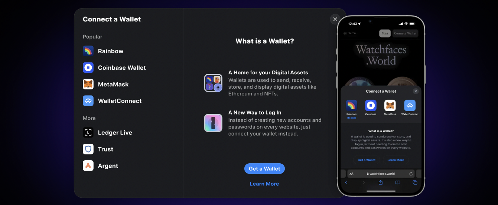
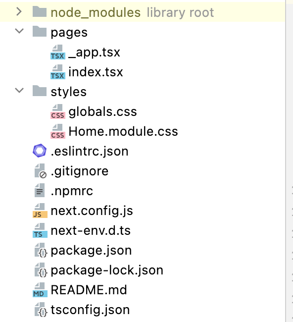
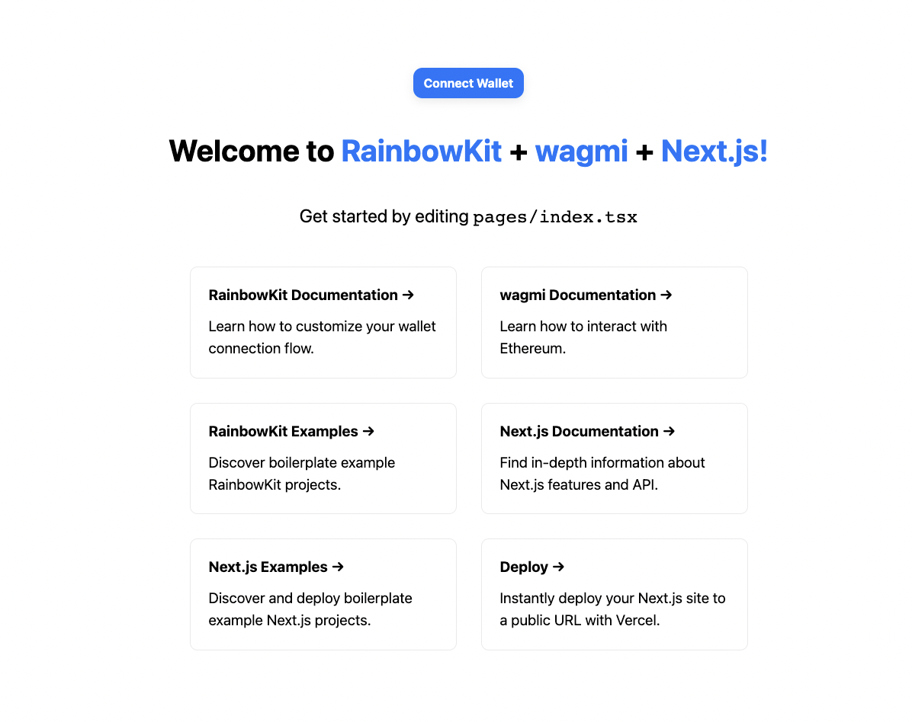
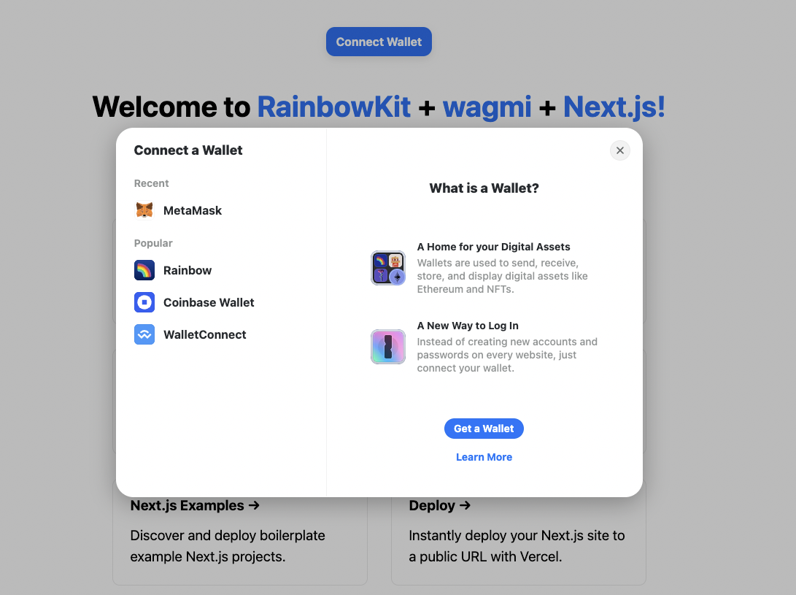
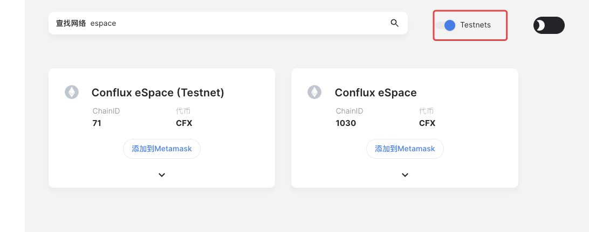
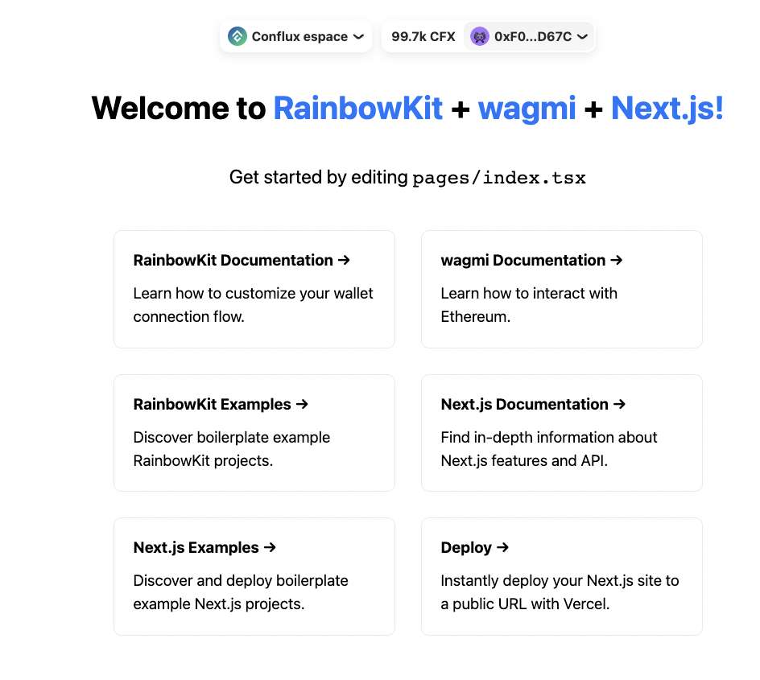

import {EmbedGiscus} from '@site/src/components/Talk'

这里主要介绍 [Rainbowkit](https://www.rainbowkit.com/) 与 [wagmi](https://wagmi.sh/docs/getting-started) 库的使用

### Rainbowkit 的espace连接



Rainbow 推出 Rainbow Kit，该工具可简化开发人员在开发 dapp 时需要进行的多钱包、多网络连接支持工作。RainbowKit 支持所有 EVM 兼容链，其代码已开源并获得 MIT 认证。主要适用于React
Dapp的开发。

所以conflux也可以支持此库，只是目前的显示上会有一些小问题待解决

下面进入正题：

Rainbowkit算是一个工具，可以结合使用 [`wagmi` ](https://wagmi.sh/docs/getting-started), wagmi是一个React
hook的集合，包含了你开始使用EVM所需的一切。wagmi使得“连接钱包”、显示ENS和平衡信息、签署消息、与合约交互，以及缓存、请求重复数据删除和持久化等功能变得更加容易。不过由于Conflux不支持ENS的关系，可能不能显示相关的数据。

### 新建好node环境

[https://nodejs.org/zh-cn/download/](https://nodejs.org/zh-cn/download/)

### 新建React rainbow项目

```js
npm
init
@rainbow
-me / rainbowkit
@latest
```


即可创建完成，目录结构：



如果是自己创建的React项目，则直接使用下列方式：

接下来是必要的库：

```
npm install @rainbow-me/rainbowkit wagmi ethers
```

或者直接在 `package.json` 文件中添加

```js
"@rainbow-me/rainbowkit"
:
"^0.4.8",
    "wagmi"
:
"^0.6.3",
    "ethers"
:
"^5.6.9",
```

然后执行 `npm install` 或者 `yarn` 安装必要的库

执行项目：

```js
npm
run
dev
```

打开  http://localhost:3000/

显示：



途中已经出现 `Connect Wallet` 与其他文档说明启动成功，点击后即可显示出：



点击 `metamask` 会显示默认去连接 ethereum 的主网，所以需要先配置一下

修改 `pages/_app.tsx` （直接复制即可）

```js
import '../styles/globals.css';
import '@rainbow-me/rainbowkit/styles.css';
import type {AppProps} from 'next/app';
import {Chain, RainbowKitProvider, getDefaultWallets} from '@rainbow-me/rainbowkit';
import {chain, configureChains, createClient, WagmiConfig} from 'wagmi';
import {alchemyProvider} from 'wagmi/providers/alchemy';
import {publicProvider} from 'wagmi/providers/public';

const confluxChain: Chain = {
    id: 71,
    name: 'Conflux espace',
    network: 'conflux',
    iconUrl: 'https://d1fdloi71mui9q.cloudfront.net/ZQBnCDJHSbaycb4SHrPr_kN7TDR5mVG4S7nF7',
    iconBackground: '#fff',
    nativeCurrency: {
        decimals: 18,
        name: 'Conflux',
        symbol: 'CFX',
    },
    rpcUrls: {
        default: 'https://evmtestnet.confluxrpc.com',
    },
    blockExplorers: {
        default: {name: 'Evmtestnet', url: 'https://evmtestnet.confluxscan.net'},
    },
    testnet: true,
};

const {chains, provider, webSocketProvider} = configureChains(
    [
        confluxChain,
        chain.mainnet,
        chain.polygon,
        chain.optimism,
        chain.arbitrum,
        ...(process.env.NEXT_PUBLIC_ENABLE_TESTNETS === 'true'
            ? [chain.goerli, chain.kovan, chain.rinkeby, chain.ropsten]
            : []),
    ],
    [
        alchemyProvider({
            // This is Alchemy's default API key.
            // You can get your own at https://dashboard.alchemyapi.io
            apiKey: '_gg7wSSi0KMBsdKnGVfHDueq6xMB9EkC',
        }),
        publicProvider(),
    ]
);

const {connectors} = getDefaultWallets({
    appName: 'RainbowKit App',
    chains,
});

const wagmiClient = createClient({
    autoConnect: true,
    connectors,
    provider,
    webSocketProvider,
});

function MyApp({Component, pageProps}: AppProps) {
    return (
        <WagmiConfig client={wagmiClient}>
            <RainbowKitProvider chains={chains}>
                <Component {...pageProps} />
            </RainbowKitProvider>
        </WagmiConfig>
    );
}

export default MyApp;

```

连接前，记得在 https://chainlist.org/zh 中找到espace的测试网，连接后就直接添加：



直接使用测试网即可。

再次点击 `Connect Wallet` 即可正常显示内容，显示Conflux 已连接



其他的关于contract的调用，可以参考 [ wagmi ](https://wagmi.sh/docs/getting-started)

<EmbedGiscus>giscusReact</EmbedGiscus>
